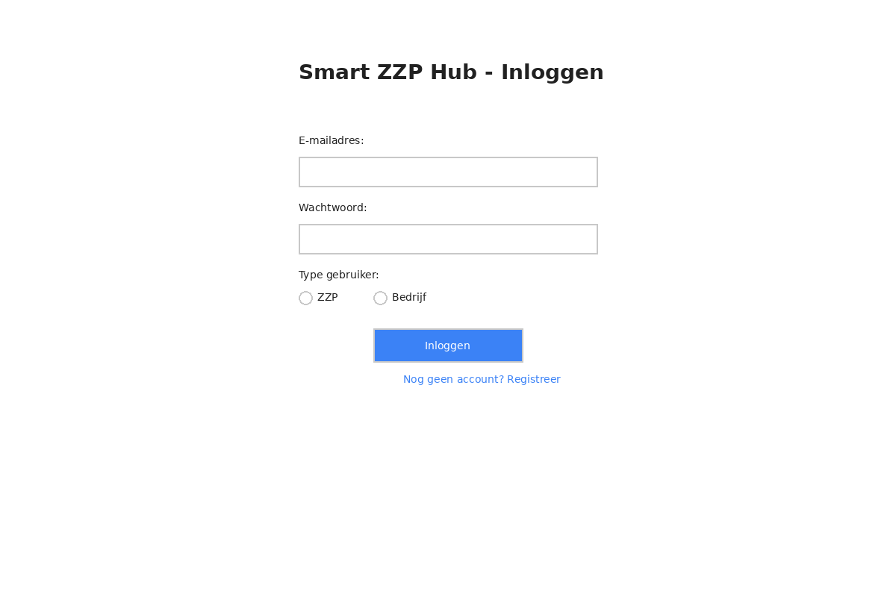
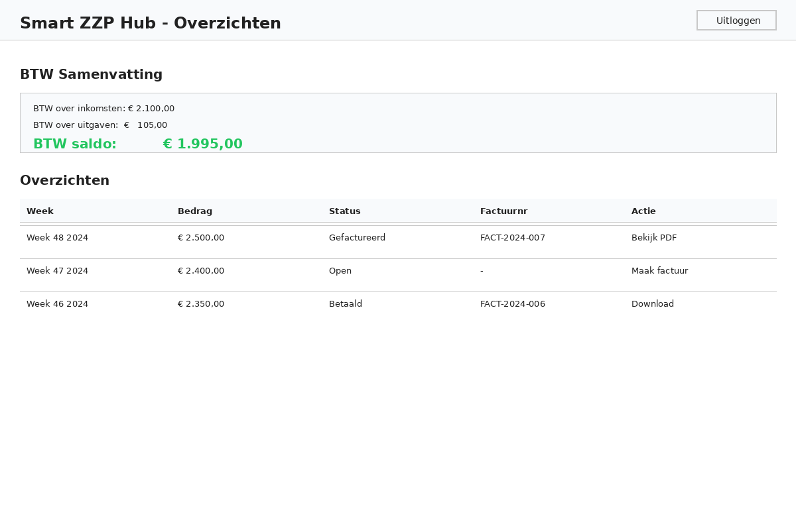
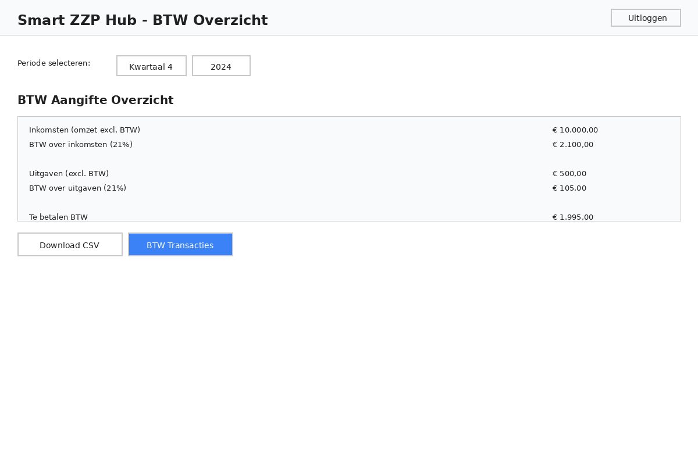
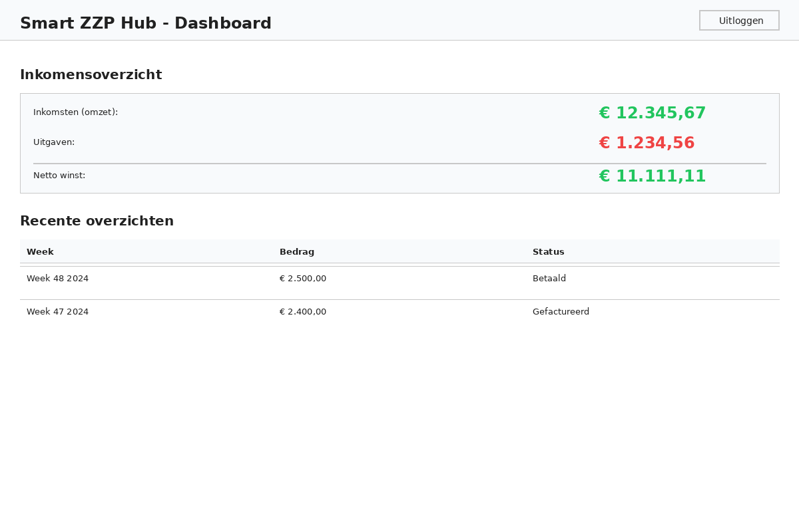
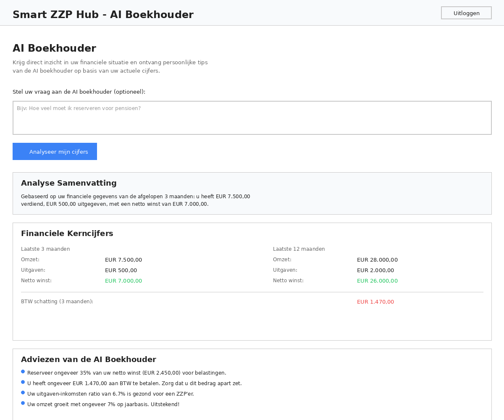
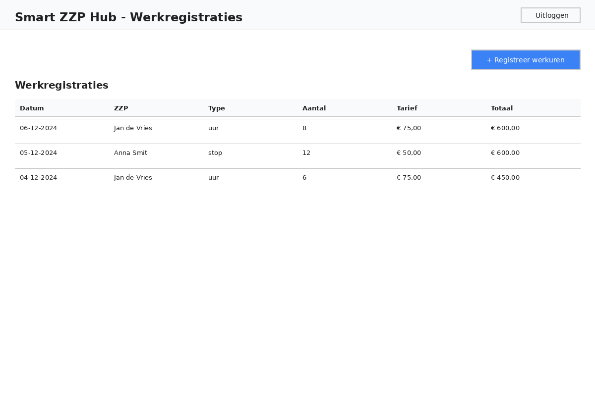
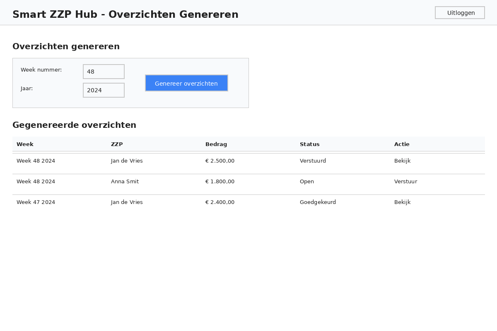
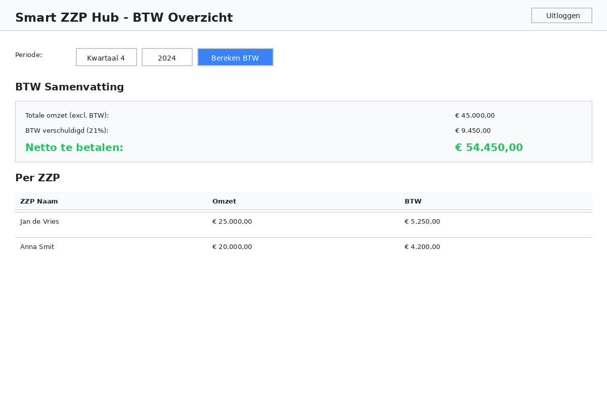

# Smart ZZP Hub - UI Voorbeelden

Deze pagina toont voorbeelden van de gebruikersinterface van Smart ZZP Hub, met screenshots van de belangrijkste schermen voor zowel ZZP-gebruikers als bedrijven.

## ZZP Gebruiker Schermen

### Login Pagina

**Inloggen**

Het startscherm waar ZZP-gebruikers en bedrijven kunnen inloggen met hun e-mailadres en wachtwoord. Nieuwe gebruikers kunnen zich ook registreren via deze pagina.

---

### Overzichten Pagina

**Overzichten beheren**

ZZP-gebruikers kunnen hier hun weekoverzichten bekijken, gefactureerde werk inzien, en nieuwe facturen genereren. De pagina toont ook een BTW-samenvatting en uitgaven overzicht.

---

### BTW Overzicht

**BTW Aangifte**

Gedetailleerd overzicht van BTW over inkomsten en uitgaven voor een geselecteerde periode. ZZP-gebruikers kunnen hier hun BTW-aangifte voorbereiden en transacties bekijken.

---

### Dashboard

**Inkomensoverzicht Dashboard**

Een overzichtelijk dashboard met financiële statistieken: totale inkomsten, uitgaven, en netto winst. Toont ook recente overzichten in één oogopslag.

---

### AI Boekhouder

**Financiële analyse met AI**

Een geavanceerd analytics dashboard dat ZZP-gebruikers inzicht geeft in hun financiële gezondheid. Het systeem analyseert historische data, berekent gemiddelden en volatiliteit, en geeft gepersonaliseerde aanbevelingen voor financieel management.

---

## Bedrijf Schermen

### Werkregistraties

**Werkuren registreren**

Bedrijven kunnen hier werkuren en stops voor ZZP-gebruikers registreren. Elke registratie bevat datum, type werk, aantal uren/stops, en het afgesproken tarief.

---

### Overzichten Genereren

**Weekoverzichten maken**

Bedrijven genereren hier weekoverzichten voor hun ZZP-medewerkers. De pagina toont welke overzichten al gegenereerd zijn en hun status (open, verstuurd, goedgekeurd).

---

### BTW Overzicht Bedrijf

**BTW per ZZP**

Bedrijven kunnen hun totale BTW-verplichting bekijken, uitgesplitst per ZZP-medewerker. Handig voor administratie en rapportage.

---

## Technische Details

- **UI Taal**: Nederlands (alle labels, knoppen, en berichten)
- **Code Taal**: Engels (alle code, variabelen, en comments)
- **Kleurenschema**: Clean wit met blauwe accenten
- **Responsive**: Ontworpen voor desktop en tablet gebruik

## Navigatie

- **ZZP Portal**: Login → Overzichten → BTW → Dashboard
- **Bedrijf Portal**: Login → Werkregistraties → Overzichten → BTW

---

*Deze voorbeelden zijn gegenereerd als mock-ups om de interface te illustreren. De werkelijke applicatie bevat volledige functionaliteit en interactieve elementen.*
